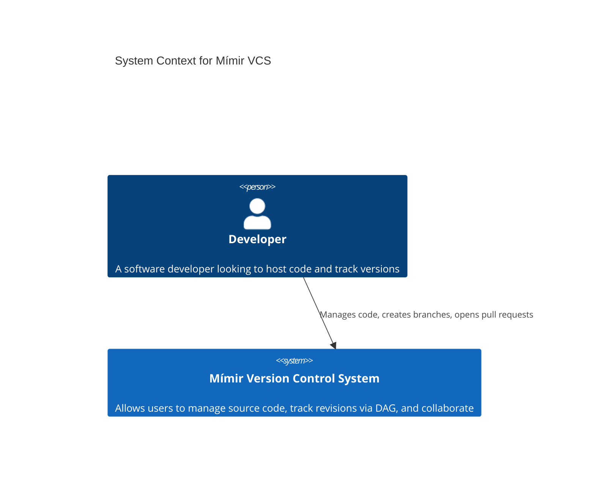
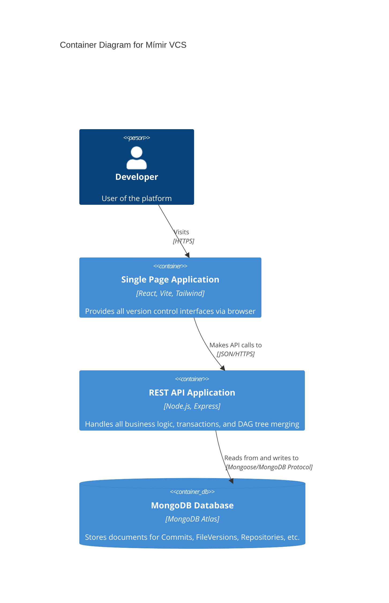
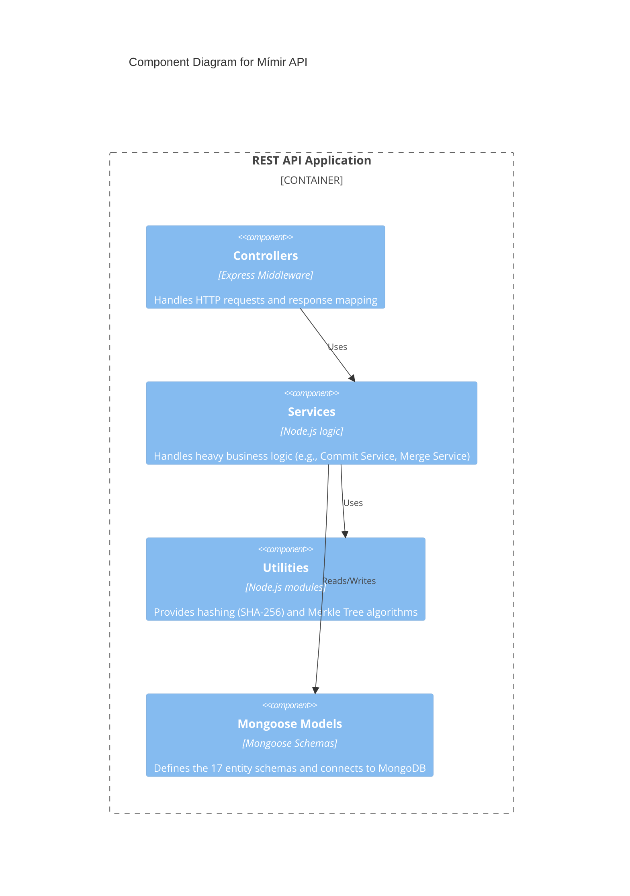

# Mímir Architecture (C4 Model)

## Context Diagram

```mermaid
C4Context
    title System Context for Mímir VCS

    Person(user, "Developer", "A software developer looking to host code and track versions")
    System(mimir, "Mímir Version Control System", "Allows users to manage source code, track revisions via DAG, and collaborate")
    
    Rel(user, mimir, "Manages code, creates branches, opens pull requests")
```

## Container Diagram

```mermaid
C4Container
    title Container Diagram for Mímir VCS

    Person(user, "Developer", "User of the platform")
    
    Container(spa, "Single Page Application", "React, Vite, Tailwind", "Provides all version control interfaces via browser")
    Container(api, "REST API Application", "Node.js, Express", "Handles all business logic, transactions, and DAG tree merging")
    ContainerDb(db, "MongoDB Database", "MongoDB Atlas", "Stores documents for Commits, FileVersions, Repositories, etc.")
    
    Rel(user, spa, "Visits", "HTTPS")
    Rel(spa, api, "Makes API calls to", "JSON/HTTPS")
    Rel(api, db, "Reads from and writes to", "Mongoose/MongoDB Protocol")
```

## Component Diagram (Backend API)

```mermaid
C4Component
    title Component Diagram for Mímir API

    Container_Boundary(api, "REST API Application") {
        Component(controllers, "Controllers", "Express Middleware", "Handles HTTP requests and response mapping")
        Component(services, "Services", "Node.js logic", "Handles heavy business logic (e.g., Commit Service, Merge Service)")
        Component(utils, "Utilities", "Node.js modules", "Provides hashing (SHA-256) and Merkle Tree algorithms")
        Component(models, "Mongoose Models", "Mongoose Schemas", "Defines the 17 entity schemas and connects to MongoDB")
    }

    Rel(controllers, services, "Uses")
    Rel(services, utils, "Uses")
    Rel(services, models, "Reads/Writes")
```
